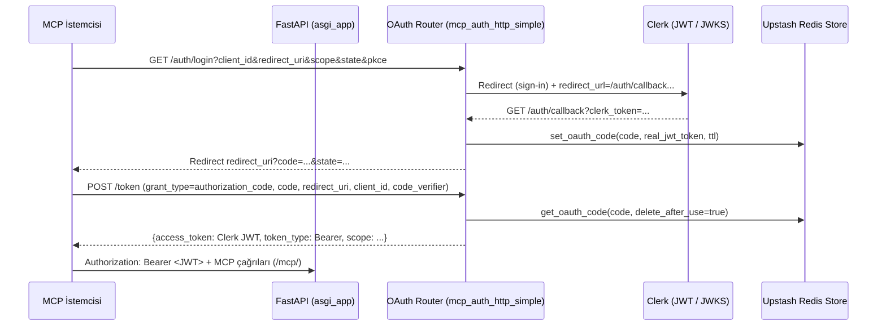

# yargi-mcp Entegrasyon ve Mimari İnceleme Raporu

## Yönetici Özeti

Bu rapor, entity["company","GitHub","code hosting platform"] üzerinde yayınlanan **yargi-mcp** deposunun (analiz tarihi: **13 Mart 2026**, Europe/Istanbul) kod ve dokümantasyonuna dayanarak derinlemesine entegrasyon incelemesini sunar. Proje, entity["people","Said Surucu","open-source developer"] tarafından geliştirilen ve **Türk hukuk veri kaynaklarına erişimi MCP (Model Context Protocol) araçları olarak sunan** bir FastMCP sunucusudur; istemciler (ör. MCP destekli LLM uygulamaları) bu araçlarla **arama** ve **belge getirme** akışlarını standartlaştırılmış bir protokol üzerinden kullanabilir. citeturn44view2turn43view1

Entegrasyon açısından iki ana kullanım şekli öne çıkar:

- **Remote MCP**: README’de “Kurulum gerektirmez” olarak paylaşılan uzak MCP adresi üzerinden doğrudan kullanım (örnek endpoint: `https://yargimcp.fastmcp.app/mcp`). citeturn44view2  
- **Self-host / ASGI web servisi**: FastAPI sarmalayıcı + FastMCP Starlette alt uygulaması ile `/mcp/` altında HTTP taşımacılığı sunan dağıtım (Docker/Compose, Uvicorn/Gunicorn, Nginx reverse proxy, Kubernetes vb.). citeturn33view0turn43view0turn42view0turn42view1

Arama kabiliyeti iki katmandadır:

- **Bedesten Birleşik Arama**: Çoklu mahkeme türleri (Yargıtay/Danıştay/Yerel/İstinaf/KYB) için tek araçla arama; operatör desteği (+ zorunlu, - hariç, AND/OR/NOT, tam ifade) ve kapsamlı **daire filtreleme** (BirimAdiEnum). citeturn32view2turn45view0turn45view1  
- **Opsiyonel Semantik Arama**: `OPENROUTER_API_KEY` tanımlıysa aktif olan, Bedesten’den ilk 100 sonucu alıp karar metinlerini indirerek entity["company","OpenRouter","ai api gateway"] üzerinden embedding üretimi ile anlamsal yeniden sıralama yapan araç. citeturn41view1turn30view2turn12view0turn11view1

Kimlik doğrulama tarafında proje, `ENABLE_AUTH=true` iken entity["company","Clerk","authentication platform"] tabanlı OAuth/JWT doğrulamayı hedefler; ayrıca OAuth yetkilendirme kodlarını çoklu-instance senaryolarında saklamak için entity["company","Upstash","serverless redis provider"] Redis REST tabanlı bir store modülü sunar. citeturn33view0turn38view2turn40view0turn8view0

Önemli risk/pitfall: `search_bedesten_unified` içinde erişim belirteci doğrulaması/ kapsam kontrolü pratikte “dev mode fallback” ile gevşetilmiş görünür; production entegrasyonda bu davranışın sıkılaştırılması gerekir. citeturn32view3

## Depo Genel Bakış ve Kapsam

Depo, Türk hukuk kaynaklarına erişimi bir MCP sunucusu olarak sunmayı amaçlar ve README’de; Yargıtay, Danıştay, UYAP Emsal, Uyuşmazlık Mahkemesi, AYM (norm denetimi + bireysel başvuru), KİK, Rekabet Kurumu, Sayıştay, KVKK, BDDK ve Sigorta Tahkim gibi kaynakların araçlarla erişilebilir hale geldiği belirtilir. citeturn44view2

Projenin paket kimliği ve sürüm bilgisi `pyproject.toml` üzerinde **`name="yargi-mcp"`**, **`version="0.2.0"`**, **`requires-python=">=3.11"`** olarak tanımlıdır; buna karşılık MCP uygulama nesnesinin kendi “server version” alanı kodda **`0.1.6`** olarak geçmektedir. Bu ikilik, entegrasyonda sürüm uyumluluğunu takip etmeyi önemli kılar (bkz. “Geriye dönük uyumluluk” notları). citeturn43view1turn24view1

Repo görünümünde **Issues = 0** olduğu görülür; bu nedenle karar/bug izleri daha çok commit geçmişi ve dokümantasyondaki açıklamalardan çıkarılabilmektedir. citeturn46view0

Ayrıca proje, (1) standart MCP sunucusu çalıştırma (CLI/uvx), (2) ASGI web servisi olarak yayınlama ve (3) Docker/Compose ile paketleme üzere çoklu dağıtım biçimlerini doğrudan depoda konumlandırır. citeturn44view2turn43view0turn42view0turn42view1

## Mimari ve Ana Bileşenler

Bu bölümde, ekosistemi “sunucu çekirdeği”, “veri kaynağı istemcileri”, “ASGI/HTTP sarmalayıcı”, “kimlik doğrulama/OAuth katmanı”, “opsiyonel semantik arama modülü” olarak ele alıyorum.

**Çekirdek (mcp_server_main.py)**: Sunucu, FastMCP uygulamasını oluşturur ve araçları tanımlar. Ayrıca MCP spesifikasyon uyumluluğu için JSON-RPC `id: null` bildirimlerinin yanlışlıkla “notification” sayılmasını engellemek üzere Pydantic model ayarıyla `extra="forbid"` yönünde bir “spec compliance” yaması içerir. citeturn29view0

**Araç/İstemci katmanı**: Kodda çok sayıda modül import edilir (örn. `bedesten_mcp_module`, `emsal_mcp_module`, `uyusmazlik_mcp_module`, `anayasa_mcp_module`, `kik_mcp_module`, `rekabet_mcp_module`, `sayistay_mcp_module`, `kvkk_mcp_module`, `bddk_mcp_module`, `sigorta_tahkim_mcp_module`). Bu, mimarinin “birden çok veri kaynağı için ayrı istemci + Pydantic model” yaklaşımıyla genişlediğini gösterir. citeturn15view2turn44view2

**ASGI/HTTP sarmalayıcı (asgi_app.py)**: FastAPI uygulaması, MCP Starlette alt uygulamasını `/mcp/` yoluna mount eder; ayrıca `/health`, `/status`, discovery ve “well-known” OAuth/MCP endpoint’leri sağlar. JSON çıktılarında Türkçe karakterler için `ensure_ascii=False` kullanan özel JSONResponse sınıfı tanımlanmıştır. citeturn33view0turn34view0turn34view4

**OAuth/Authentication modülleri**: `ENABLE_AUTH=true` iken “Bearer/JWT doğrulama” ve OAuth akışı devreye girer. Basitleştirilmiş OAuth router (`mcp_auth_http_simple.py`), yetkilendirme kodu üretimi, dinamik istemci kaydı ve `/token` endpoint’inde kod→JWT değişimini içerir; kod saklama için Redis store’la bütünleşir. citeturn33view0turn38view3turn39view0turn40view0

**Opsiyonel semantik arama**: `OPENROUTER_API_KEY` varsa semantik arama aracı görünür; Bedesten’den çekilen kararların metnini Markdown’a çevirip embedding üretir, in-memory vektör store’da benzerlik aramasıyla yeniden sıralar. citeturn41view1turn31view2turn30view2turn12view0turn11view1

Aşağıdaki diyagram, bileşenlerin uçtan uca ilişkilendiği “hedef mimariyi” göstermektedir (depo kodu ve dokümanlardaki route/akış tanımlarına dayanarak). citeturn33view0turn32view3turn30view2turn19view0

```mermaid
flowchart LR
  A[MCP İstemcisi\n(Claude Desktop / Özel Uygulama)] -->|HTTP| B[/FastAPI Wrapper\nasgi_app.py/]
  B -->|mount /mcp/| C[FastMCP Starlette App\nmcp_server_main.create_app()]
  C --> D[Tool Manager\n(MCP Tools)]
  D --> E[BedestenApiClient\nbedesten.adalet.gov.tr]
  D --> F[Emsal / Uyuşmazlık / AYM / KİK / ...\n*_mcp_module clients]
  D --> G{Semantik Arama Aktif mi?\nOPENROUTER_API_KEY}
  G -->|Evet| H[DocumentProcessor\nChunking/Cleaning]
  H --> I[OpenRouterEmbedder\nGemini embedding]
  I --> J[VectorStore (in-memory numpy)]
  J --> D
  B --> K[/.well-known/*\nOAuth & MCP discovery]
  B --> L[/health, /status]
  B --> M[OAuth Router\nmcp_auth_http_simple.py\n(opsiyonel)]
  M --> N[RedisSessionStore\nUpstash Redis]
```

## Bağımlılıklar, Çalışma Zamanı ve Kurulum

### Çalışma zamanı ve sürümler

- Proje **Python >= 3.11** hedefler (`requires-python=">=3.11"`). citeturn43view1  
- Docker imajı tabanı olarak **`python:3.12-slim`** kullanılır; container içinde `uv` ile kurulum yapılır. citeturn42view0  

### Doğrudan bağımlılıklar

`pyproject.toml` üzerinden görülen temel bağımlılıklar arasında `httpx`, `pydantic`, `fastmcp`, `fastapi`, `markitdown[pdf]`, `pypdf`, `openai`, `numpy`, `beautifulsoup4`, `aiohttp` bulunur. citeturn43view1

Opsiyonel gruplar:

- **asgi**: `uvicorn[standard]`, `starlette` citeturn43view1  
- **production**: `gunicorn`, `uvicorn[standard]` citeturn43view1  
- **saas**: `clerk-backend-api`, `stripe`, `upstash-redis`, `tiktoken`, `PyJWT` citeturn43view1turn33view0turn40view0  

### Kurulum ve çalıştırma seçenekleri

Aşağıdaki tablo, “en az sürtünmeyle çalıştırma”dan “tam kontrolle self-host”a uzanan pratik entegrasyon seçeneklerini karşılaştırır (tamamı repo dokümantasyonu ve konfig dosyalarının sunduğu yöntemlerdir). citeturn44view2turn43view0turn42view1turn42view0

| Seçenek | Ne zaman uygun? | Artılar | Eksiler / Riskler | Kaynak |
|---|---|---|---|---|
| Remote MCP endpoint | Hızlı POC / masaüstü araç entegrasyonu | “Kurulum yok”; istemci sadece URL ile bağlanır | Üçüncü taraf endpoint’e bağımlılık; kurumsal veri politikalarıyla çatışabilir | README (Remote MCP) |
| Yerel MCP (uvx / CLI) | Kullanıcı bilgisayarında (Claude Desktop vb.) | İstemci konfigürasyonu kolay; süreç yerelde | Gözlemlenebilirlik / ölçekleme sınırlı | README konfig blokları |
| ASGI (Uvicorn/Gunicorn) | Kurumsal servis olarak yayınlama | `/health`, `/status`, OAuth/well-known endpoint’leri | Auth/secret yönetimi gerekir | docs/DEPLOYMENT, asgi_app |
| Docker / Compose | Standartlaştırılmış dağıtım | Tek komutla ayağa kaldırma; Nginx/Redis profilleri | Compose dosyasında ortam değişkenleri uyumu şart | Dockerfile, docker-compose |
| Kubernetes | Yüksek erişilebilirlik | Çoklu replica, probe’lar | YAML bakım maliyeti; state (Redis) ayrı yönetilir | docs/DEPLOYMENT |

### Örnek komutlar (depo dokümanlarıyla uyumlu)

**ASGI hızlı başlangıç** (lokal):

```bash
pip install uvicorn
pip install -e .
python run_asgi.py
# veya
uvicorn asgi_app:app --host 0.0.0.0 --port 8000
```

Bu modda dokümanda örneklenen temel endpoint’ler: `/mcp/`, `/health`, `/status`. citeturn43view0

**Docker**:

```bash
docker build -t yargi-mcp .
docker run -p 8000:8000 --env-file .env yargi-mcp
```

Dockerfile, `uv` ile `.`, ayrıca `. [asgi,saas]` opsiyonellerini kurar ve `uvicorn asgi_app:app` ile başlatır. citeturn42view0turn43view0

**docker-compose** (opsiyonel Nginx/Redis profilleriyle):

```bash
docker-compose up
docker-compose --profile production up
docker-compose --profile with-cache up
```

Compose dosyasında Nginx reverse proxy ve Redis profilleri tanımlıdır (Redis “future enhancement” notuyla). citeturn42view1turn43view0

## Konfigürasyon, Ortam Değişkenleri ve Kimlik Doğrulama

### Ortam değişkenleri ve konfig dosyaları

Projede yapılandırma öncelikle **environment variable** yaklaşımıyla yapılır. Örnek `.env` şablonu, auth/saas, CORS ve semantik arama anahtarlarını içerir. citeturn8view0turn33view0turn40view0

En kritik değişkenler (depoda açıkça görülenler):

- `ENABLE_AUTH`: auth katmanını aç/kapat. citeturn8view0turn33view0turn42view0turn46view0  
- `ALLOWED_ORIGINS`: CORS allowlist (virgülle ayrılmış). citeturn8view0turn33view0turn43view0  
- `HOST`, `PORT`, `LOG_LEVEL`, `BASE_URL`: servis host/port/log ve dış URL. citeturn8view0turn33view0turn43view0turn46view0  
- `OPENROUTER_API_KEY`: semantik aramayı aktif eden anahtar. citeturn8view0turn41view1turn12view0  
- OAuth/Clerk: `CLERK_ISSUER`, `CLERK_SECRET_KEY`, `CLERK_PUBLISHABLE_KEY`, `CLERK_DOMAIN` vb. citeturn8view0turn33view0turn38view0  
- SaaS/ödemeler: `STRIPE_SECRET_KEY`, `STRIPE_WEBHOOK_SECRET` (router koşullu import). citeturn8view0turn33view0  
- Redis store (çoklu instance OAuth code saklama): `UPSTASH_REDIS_REST_URL`, `UPSTASH_REDIS_REST_TOKEN`, `OAUTH_CODE_TTL`, `SESSION_TTL`. citeturn40view0turn40view2  

Dağıtım ve runtime örnekleri:

- `fly-no-auth.toml`: auth kapalı, bağlantı concurrency limitleri tanımlı (connections 80/100 soft/hard). citeturn46view0  
- `docker-compose.yml`: port mapping, `ALLOWED_ORIGINS`, `LOG_LEVEL` vb.; Nginx ve Redis profilleri. citeturn42view1  
- `docs/DEPLOYMENT.md`: `.env` oluşturma, Uvicorn/Gunicorn, Nginx, systemd örnekleri ve güvenlik notları. citeturn43view0  

### AuthN/AuthZ (OAuth2 + Bearer JWT) akışı

ASGI katmanı, `ENABLE_AUTH=true` iken FastMCP tarafına **Bearer auth provider** enjekte eder. Kod, bazı FastMCP sürümleri için farklı auth sınıflarına uyum sağlayacak şekilde import denemeleri yapar (JWTVerifier vs BearerAuthProvider) ve Clerk JWKS endpoint’i ile RS256 doğrulama kurar. citeturn33view0turn34view0

Auth ile ilgili servis endpoint’leri iki yerde görünür:

1) **asgi_app.py**: `/auth/mcp-callback` ve `/auth/mcp-token` gibi MCP entegrasyonuna yönelik “kullanıcıya talimat dönen” endpoint’ler + well-known metadata + `/clerk-proxy/*` CORS proxy. citeturn34view0turn34view4turn33view0  

2) **mcp_auth_http_simple.py**: `/auth/login` (Clerk sign-in sayfasına redirect), `/auth/callback` (GET), `/token` (authorization_code → Clerk JWT), `/register` (dinamik client registration) ve OAuth metadata (`/.well-known/oauth-authorization-server`). Ayrıca OAuth kodlarını Redis’te saklamak için “multi-machine deployment” hedefi açıkça belirtilir. citeturn38view3turn38view4turn39view0turn38view5turn38view2

Aşağıdaki akış, repo kodunun tarif ettiği OAuth “code → token” modelini özetler. citeturn38view3turn39view0turn40view0



## Arama, İndeksleme, Veri Modeli ve API Yüzeyleri

### Exposed API / endpoint yüzeyi

ASGI web servisi, FastAPI seviyesinde sağlık ve keşif endpoint’leri sağlar:

- `/health`: servis sağlığı ve tool sayısı gibi meta bilgiler. citeturn33view0turn43view0  
- `/status`: tool listesi (kısaltılmış açıklamalar) ve “transport=streamable_http” gibi durum bilgisi. citeturn34view0  
- `/mcp/`: MCP Starlette alt uygulaması mount noktası; `/mcp` için 308 redirect tanımı var (method korunarak). citeturn33view0turn34view4  
- `/.well-known/*`: OAuth Authorization Server metadata, protected resource metadata ve MCP discovery endpoint’leri. citeturn34view0turn33view0  

Bu rapor kapsamında MCP’nin JSON-RPC wire formatı repo içinde ayrıntılı “şema dokümanı” olarak verilmediği için, MCP mesaj düzeyi I/O şemaları **depoda açıkça tanımlanmamış** sayılır; buna karşılık tool fonksiyon imzaları ve Pydantic modeller, uygulama entegrasyonunda pratik şema kaynağıdır. citeturn32view3turn45view0turn43view1

### Bedesten birleşik arama (keyword / filtre / pagination)

#### Tool: `search_bedesten_unified`

Bu araç, Bedesten API ile birleşik arama yapar. Parametreler, kod içindeki Field açıklamalarında ayrıntılıdır:

_attach edilebilir sorgu operatörleri_ (desteklenenler):  
- Basit kelime/ifade, tam ifade (`"\"...\""`), zorunlu terim (`+`), hariç tutma (`-`), `AND/OR/NOT`.  
_desteklenmeyenler_: wildcard, regex, fuzzy, proximity. citeturn32view2turn45view0

_filtreler_:
- `court_types`: varsayılan listede en az Yargıtay ve Danıştay geçer; modelde ayrıca `YERELHUKUK`, `ISTINAFHUKUK`, `KYB` tanımlıdır. citeturn32view2turn45view0  
- `birimAdi`: Yargıtay/Danıştay daire/kurul filtreleri, **kısaltılmış enum** (H1…H23, C1…C23, HGK/CGK…, D1…D17, IDDK/VDDK…, AYIM*). citeturn32view2turn45view1turn45view0  
- `kararTarihiStart`, `kararTarihiEnd`: ISO 8601 formatı beklenir; kod “YYYY-MM-DD” gelirse otomatik `T00:00:00.000Z` / `T23:59:59.999Z` dönüştürür. citeturn32view3turn45view0  

_sayfalama_:
- Kod tarafında `pageSize` sabit **10** kullanılır ve `pageNumber` parametresiyle sayfa çekilir. citeturn32view3turn45view0

_çıktı şeması_ (pratik):  
- `decisions`: Bedesten karar nesnelerinin `model_dump()` edilmiş listesi  
- `total_records`, `requested_page`, `page_size`, `searched_courts` citeturn32view3turn45view0

#### Bedesten API istemcisi ve belge dönüşümü

`BedestenApiClient`, Bedesten domainine `httpx.AsyncClient` ile bağlanır ve iki endpoint kullanır:  
- `POST /emsal-karar/searchDocuments`  
- `POST /emsal-karar/getDocumentContent` citeturn21view0turn19view0turn21view1

İstemci, `Accept-Language: tr-TR` ve “UyapMevzuat” uygulama adı benzeri başlıklar set eder; ayrıca `birimAdi` kısaltmalarını API’nin beklediği Türkçe tam ada map’ler (örn. `H1` → “1. Hukuk Dairesi”). citeturn21view0turn45view1turn21view1

Belge getirme akışında API’nin verdiği içerik **base64** çözülür; içerik türüne göre HTML veya PDF Markdown’a çevrilir. Bu dönüşüm `MarkItDown` ile **BytesIO** üzerinden geçici dosya oluşturmadan yapılır. citeturn21view2turn22view1turn22view3

### Opsiyonel semantik arama (embedding ile re-ranking)

#### Tool: `search_bedesten_semantic`

Semantik arama aracı, sadece `OPENROUTER_API_KEY` varsa kullanılabilir (README’de de “ayarlanmazsa görünmez” notu vardır). citeturn41view1turn12view0turn31view2

Çalışma adımları kodda açıkça 5 aşama olarak kurgulanır:  
1) `initial_keyword` ile Bedesten’den toplam ~100 karar çekme (mahkeme türlerine dağıtılmış limit)  
2) Her karar için Markdown metni indirme ve işleme  
3) Sorgu ve doküman embedding’lerini üretme  
4) Vektör store’a ekleme ve benzerlik araması  
5) Sonuçları biçimlendirme (başlık, skor, preview, kaynak URL, istatistik) citeturn30view2turn30view3turn31view2

Embedding tarafı:

- Embedder, entity["company","OpenRouter","ai api gateway"] üzerinde **`google/gemini-embedding-001`** modelini kullanacak şekilde yapılandırılmıştır ve embedding boyutu **3072** kabul edilir. (Projede “Google Gemini embedding” ifadesi geçer; sağlayıcı yolu OpenRouter’dır.) citeturn12view0turn30view2  
- Vektörler L2 normalize edilir (cosine benzerliği için). citeturn12view0turn11view1  

Metin işleme:

- `DocumentProcessor`, Türkçe karakterleri koruyacak şekilde regex/temizleme uygular ve chunking yapar; kısaltma eşleşmeleri ve cümle bölme heuristik’leri içerir. citeturn11view0  

Vektör store / skor:

- `VectorStore` in-memory çalışır (numpy); kalıcı depolama yoktur. Kodda ileride FAISS/Chroma gibi backend’lere geçilebileceği not edilir. citeturn11view1  
- Aramada `threshold=0.3` uygulanır; `top_k` 1–50 aralığındadır ve sonuçlar `similarity_score` ile döndürülür. citeturn30view2turn30view3  

### Veri modeli ve depolama

Bu projede “kalıcı karar veritabanı” sunucu içinde tutulmaz; veriler, ilgili resmi/yarı-resmi API’lerden çağrılıp istemciye iletilir. “Kalıcı state” olarak görülen kısım daha çok:

- OAuth kodları ve session verisi için Redis store (`oauth:code:*`, `session:*` key pattern’leri; TTL ile; delete-after-use). citeturn40view0turn40view1  
- Semantik aramada geçici in-memory embedding matrisi (RAM’de; döküman sayısı ve “memory_usage_mb” hesaplanır). citeturn30view2turn11view1  

Bedesten tarafında Pydantic modeller, karar nesnesinde en az şu alanları tanımlar: `documentId`, `itemType`, `birimAdi`, `esasNo`, `kararNo`, `kararTarihiStr`, `total`, `start` vb. citeturn45view0turn32view3turn30view2

### Türkçe dil desteği, analyzers, stemming/stopwords

- Bedesten istemcisinde `Accept-Language: tr-TR` set edilmiştir (server tarafında Türkçe sonuç beklentisini güçlendirir). citeturn21view0  
- Semantik arama pipeline’ında Türkçe karakter koruma ve metin temizleme/segmentasyon vardır; ancak repo içinde **Türkçe stemming / lemmatization / stopword listeleri** veya “analyzer/tokenizer” tanımları bulunmaz. (Semantik katman embedding temellidir; keyword katmanı Bedesten’in backend aramasına dayanır.) citeturn11view0turn32view2turn45view0  
- Bedesten aramasının “relevance scoring” modeli Bedesten servisinin kendisine aittir; projede bu skorlamanın algoritması **belirtilmemiştir**. citeturn32view3turn19view0  

## Uygulamanıza Entegrasyon, Dağıtım, Performans ve İyileştirme Önerileri

### Adım adım entegrasyon stratejileri

Aşağıdaki stratejiler, “en az değişiklikle entegrasyon”dan “kendi arama indeksinizi kurma”ya doğru sıralanmıştır.

#### Strateji A: Remote MCP ile hızlı entegrasyon

Bu yaklaşım, uygulamanız bir MCP istemcisi ise (ve dış endpoint kullanımı politika olarak mümkünse) en hızlı yoldur.

1) MCP sunucu URL’sini kullanın (README’de remote MCP adresi verilmiştir):

```text
https://yargimcp.fastmcp.app/mcp
```

2) İstemci tarafında “custom connector/server” olarak ekleyin (README içinde Claude Desktop için adımlar örneklenir). citeturn44view2  

Bu stratejide auth/limit/telemetri gibi konular endpoint sağlayıcısına bağlı olacağından, kurumsal uygulamalarda genellikle Strateji B/C tercih edilir. citeturn44view2turn33view0

#### Strateji B: Uygulamanızın yanında self-host ASGI servisi yayınlamak

Bu yaklaşım, uygulamanızın (backend’inizin) yargi-mcp’yi bir **internal service** olarak çağırmasını sağlar.

1) Repo paketini kurun ve ASGI servisini çalıştırın:

```bash
pip install -e .
uvicorn asgi_app:app --host 0.0.0.0 --port 8000
```

2) Sağlık kontrolüyle doğrulayın:

```bash
curl http://localhost:8000/health
```

3) MCP endpoint’inizi uygulamanızda yapılandırın: `http://localhost:8000/mcp/` citeturn43view0turn33view0  

Auth açacaksanız:

- `ENABLE_AUTH=true` ve Clerk/OAuth değişkenlerini `.env.example` tabanlı ayarlayın; CORS için `ALLOWED_ORIGINS`’i daraltın. citeturn8view0turn33view0turn43view0  

#### Strateji C: “Retriever + Kendi İndeksiniz” (Türkçe hukuk metinleri için önerilen kurumsal yaklaşım)

Bu stratejide yargi-mcp’yi **veri alma katmanı** olarak kullanır, uygulamanızın içinde kendi arama/vektör indeksinizi kurarsınız.

- Kaynak: `search_bedesten_unified` ile ID’leri bulun → `get_bedesten_document_markdown` ile metni çekin. citeturn32view3turn31view2  
- İndeksleme: Repo içinde örnek bir in-memory vektör store vardır ancak kalıcı değildir; kurumsalda FAISS/Chroma/Elastic gibi bir depoya geçmek gerekir (repo bu geçişi “future versions” diye not eder). citeturn11view1  

Bu yaklaşım, özellikle “emsal içtihat arama” gibi bağlam yoğun senaryolarda, Türkçe morfoloji ve terminoloji için özel optimize edilmiş bir analyzer/lemmatizer ekleyebilmeniz nedeniyle daha sürdürülebilirdir. (Bu öneri geneldir; repo içinde lemmatizer yoktur.) citeturn11view0turn45view0  

### Örnek akış kodları (indexleme / güncelleme / silme / arama)

Aşağıdaki örnekler, depodaki semantik arama bileşenlerini “kendi uygulamanızda” kullanarak basit bir indeks kurma mantığını gösterir. Bu, yargi-mcp’nin sunduğu `VectorStore`’un **RAM tabanlı** olması ve kalıcılık sağlamaması nedeniyle üretimde “örnek/iskelet” olarak düşünülmelidir. citeturn11view1turn12view0turn11view0

> Not: Aşağıdaki kod, OpenRouter anahtarı gerektirir; aksi halde `OpenRouterEmbedder` çalışmaz. citeturn12view0turn8view0  

```python
"""
Örnek: Türkçe hukuk metinleri için mini indeks yapısı (RAM tabanlı)

Repo bileşenleri:
- semantic_search.processor.DocumentProcessor
- semantic_search.embedder.OpenRouterEmbedder
- semantic_search.vector_store.VectorStore
"""

from semantic_search.processor import DocumentProcessor
from semantic_search.embedder import OpenRouterEmbedder
from semantic_search.vector_store import VectorStore

# 1) İndeks oluşturma
processor = DocumentProcessor(chunk_size=1500, chunk_overlap=300)
embedder = OpenRouterEmbedder()                # OPENROUTER_API_KEY env var bekler
store = VectorStore(dimension=3072)            # repo varsayımı: 3072

def index_documents(docs: list[dict]):
    """
    docs: [{"id": "...", "text": "...", "metadata": {...}}, ...]
    """
    ids, texts, metas = [], [], []
    for d in docs:
        # (İsteğe bağlı) chunking + yeniden birleştirme (repo içindeki semantik tool'a benzer)
        chunks = processor.process_document(d["id"], d["text"], d.get("metadata", {}))
        full_text = " ".join([c.text for c in chunks]) if chunks else d["text"]

        ids.append(d["id"])
        texts.append(full_text)
        metas.append(d.get("metadata", {}))

    emb = embedder.encode_documents(texts, titles=[m.get("birim_adi", "") for m in metas])
    store.add_documents(ids=ids, texts=texts, embeddings=emb, metadata=metas)

def update_document(doc_id: str, new_text: str, new_metadata: dict):
    """
    VectorStore RAM tabanlı olduğundan en basit yaklaşım:
    - Sil (yeniden kur) veya
    - Aynı ID ile ekleyip uygulama tarafında son kaydı geçerli say
    """
    # Pratikte: kalıcı DB/vektör DB kullanıyorsanız "upsert" yapılır.
    index_documents([{"id": doc_id, "text": new_text, "metadata": new_metadata}])

def delete_document(doc_id: str):
    """
    Repo VectorStore'unda doğrudan delete API görünmüyor.
    Üretimde vektör DB kullanın veya store'u yeniden inşa edin.
    """
    raise NotImplementedError("Repo VectorStore delete sağlamıyor; yeniden build önerilir.")

def search(query: str, top_k: int = 10):
    q_emb = embedder.encode_query(query, task="search result")
    results = store.search(query_embedding=q_emb, top_k=top_k, threshold=0.3)
    return [
        {"id": doc.id, "score": float(score), "preview": doc.text[:500], "metadata": doc.metadata}
        for doc, score in results
    ]
```

Bu örnekle paralel olarak, repo içindeki `search_bedesten_semantic` aracı da Bedesten’den doküman çekip embedding üretir ve `VectorStore.search(threshold=0.3)` ile sonuç döndürür; yani “indeksleme + arama” mantığı zaten tool içinde örneklenmiştir. citeturn30view2turn31view2turn11view1

### Performans, benchmark ve ölçekleme

Repo ölçüm/benchmark sonuçları (sayısal metrikler) açıkça paylaşılmamıştır; dolayısıyla “performans iddiası” yerine depo içindeki yapıdan çıkarılabilen ölçüm noktalarını listeliyorum. citeturn43view0turn30view2

- **Token ölçümü**: `tiktoken` varsa middleware tool çağrılarında input/output token sayısını loglar (JSON log + human-readable). Bu, LLM tabanlı istemcilerde maliyet/latency analizi için değerlidir. citeturn29view0turn43view1  
- **Semantik arama maliyeti**: 100 doküman indirme + embedding çağrıları (query + docs). Bu, hem Bedesten indirme süresi hem de OpenRouter embedding latency’sine duyarlıdır; kurumsalda cache ve batch stratejisi gerekir. citeturn30view2turn19view0turn12view0  
- **Uvicorn/Gunicorn ölçekleme**: docs/DEPLOYMENT, worker sayısı ve Nginx reverse proxy önerileri verir; ayrıca Kubernetes örnek YAML’de replica=3 ve `/health` probe tanımlanır. citeturn43view0  
- **Connection concurrency**: Fly konfiginde “connections” tabanlı soft/hard limit tanımlıdır (80/100). Bu, streamable HTTP/MCP oturumları için pratik bir ayardır. citeturn46view0  

Önerilen benchmark yaklaşımı (repo yönergeleriyle uyumlu pratik):

- `/health` ve `/status` üzerinden smoke test;  
- `search_bedesten_unified` için farklı `phrase` ve `birimAdi` kombinasyonlarıyla gecikme ölçümü;  
- semantik arama açıkken “embedding + indirme” maliyetini ayrı ayrı ölçme (OpenRouter çağrıları).  
Bu ölçümler repo içinde hazır komut olarak verilmediği için uygulama sahipliğinde tasarlanmalıdır. citeturn34view0turn32view3turn30view2

### Güvenlik değerlendirmesi (input validation, rate limiting, secrets)

Depoda görülen güvenlik önlemleri ve açık alanlar:

- **MCP spec uyumu**: JSON-RPC `id=null` isteklerini reddetmeye dönük açık bir uyumluluk düzeltmesi var. citeturn29view0  
- **401 davranışı**: asgi_app, 401’lerde MCP/OAuth beklentileri için `WWW-Authenticate` header’ı ekler. citeturn33view0  
- **OAuth kod güvenliği**: Redis store, OAuth kodlarını TTL ile saklar ve “delete_after_use” ile tek kullanımlık yapar. citeturn40view1turn38view6  
- **Rate limiting**: docs/DEPLOYMENT, Nginx config içinde rate limiting bulunduğunu söyler; ancak Nginx config içeriği bu raporda ayrıntılandırılamadı (repo dosyası referanslanmış). citeturn43view0turn42view1  
- **Yetkilendirme gevşekliği riski**: `search_bedesten_unified` içinde `get_access_token()` başarısız olursa “development mode fallback” ile `dev-user`/scope set edilerek arama devam eder; production’da bunun kapatılması ve scope enforcement’ın etkinleştirilmesi önerilir. citeturn32view3  

Secrets yönetimi:

- `.env.example` ve Docker/Compose yaklaşımı secrets’ı env var üzerinden taşır; kurumsal ortamda secret manager (K8s secrets, Vault vb.) ile yönetilmelidir (repo içinde secret manager entegrasyonu belirtilmemiştir). citeturn8view0turn42view1turn43view0

### Test stratejisi, CI/CD ve geriye dönük uyumluluk

- **Test/CI/CD**: docs/DEPLOYMENT dağıtım ve operasyon önerileri içerir; ancak repo içinde doğrudan test suite/benchmark script’leri bu raporda doğrulanamadı. Bu nedenle “test kapsamı/CI pipeline” detayları **belirtilmemiş** kabul edilmelidir. citeturn43view0turn46view0  
- **Geriye dönük uyumluluk sinyalleri**: Kodda bazı parametre mapping’lerinde “backward compatibility” notları vardır (örn. Rekabet karar türü map’inde `""` ve `"ALL"` eşleme yaklaşımları). Ayrıca paket sürümü (0.2.0) ile server version (0.1.6) ayrışması, istemci entegrasyonlarında sürüm pin’lemeyi önemli hale getirir. citeturn23view3turn43view1turn24view1  

### Türkçe hukuk metinleri için önerilen iyileştirmeler ve özelleştirmeler

Aşağıdaki öneriler, repo içinde **ya hiç uygulanmamış** ya da **kısmen uygulanmış** alanlara odaklanır; hedef, Türkçe hukuk metinlerinde daha yüksek isabet ve daha düşük maliyettir.

**Arama kalitesi (Türkçe morfoloji)**  
Mevcut keyword arama Bedesten backend’ine bağlı, semantik arama ise embedding tabanlıdır; repo içinde stemming/lemmatization yoktur. Türkçe’de eklemeli yapı nedeniyle “kavram varyantları” (örn. “tazminat”, “tazminatın”, “tazminata”) için uygulama tarafında lemmatizer eklemek ciddi kazanım sağlar. Repo `DocumentProcessor` seviyesinde sadece temizleme/segmentasyon yapar. citeturn11view0turn45view0turn32view2  

**Semantik aramada chunk düzeyi embedding**  
Mevcut semantik tool, chunk’ları birleştirip metni 3000 karaktere kadar kırpar (metnin geri kalanı dışarıda kalabilir). Daha iyi yaklaşım: chunk embedding’lerini ayrı tutup “top chunk” score ile karar skorunu üretmek (MaxSim) veya hiyerarşik özetleme. citeturn30view2turn11view0  

**Kalıcı vektör indeks ve cache**  
`VectorStore` RAM tabanlıdır; repo içinde FAISS/Chroma gibi sistemlere geçiş “future” olarak işaret edilir. Üretimde cache (ör. Redis) ve kalıcı vektör DB kullanımı gerekir. Docker-compose’ta Redis profili ve docs/DEPLOYMENT’ta cache notları bu yönde bir niyete işaret eder. citeturn11view1turn42view1turn43view0  

**Auth sıkılaştırma**  
`search_bedesten_unified` gibi kritik tool’larda dev fallback kapatılmalı; `ENABLE_AUTH=true` iken token doğrulama hatası “fail closed” davranmalı. citeturn32view3turn33view0  

**Gözlemlenebilirlik**  
Token middleware mevcut; buna ek olarak “upstream API latency”, “Bedesten doküman indirme hataları”, “embedding çağrı süreleri” gibi metriklerin yapılandırılabilir log alanları halinde çıkarılması, ops ekibine doğrudan fayda sağlar. Semantik tool, adım adım log’lama yapıyor; bu log’ları metrik haline çevirmek düşük eforla mümkündür. citeturn30view2turn29view0